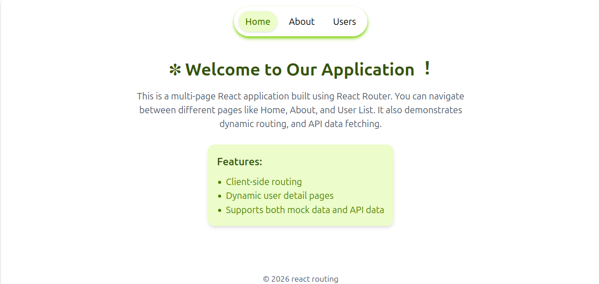
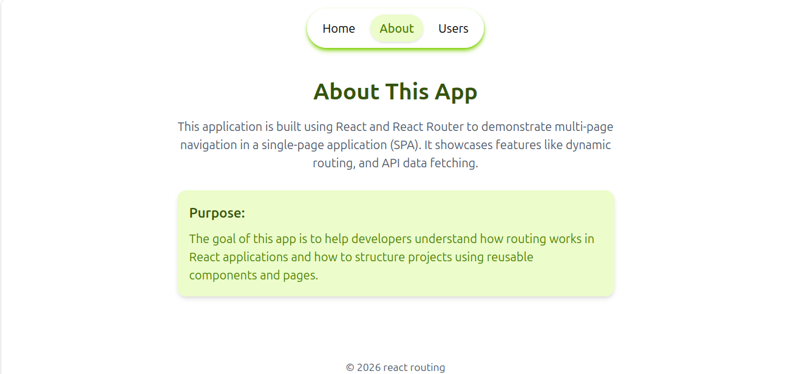
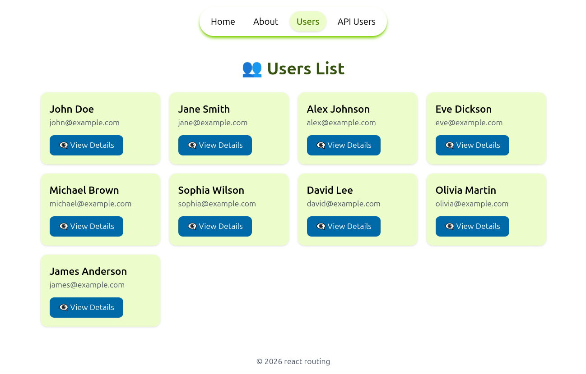
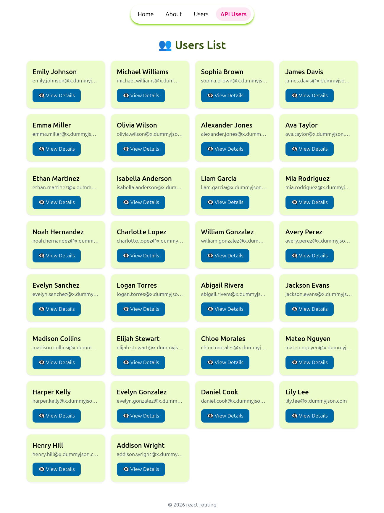
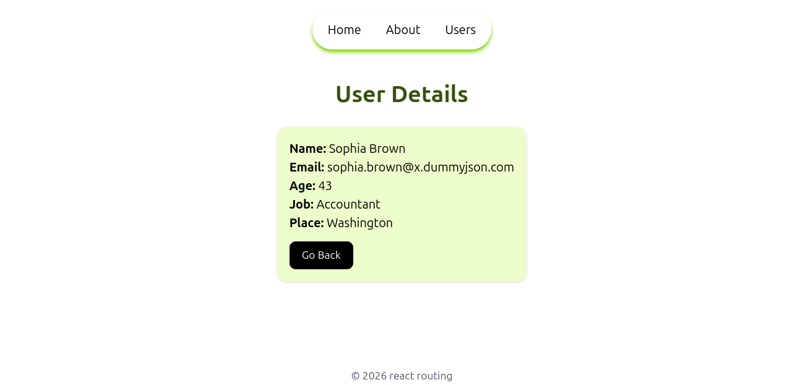

# Multi Page App
 A simple multi-page React application demonstrating routing, dynamic pages, and API integration using React Router.

## Features
- Client-side routing with React Router
- Dynamic user detail pages
- Supports both mock data and API data
- Responsive UI with Tailwind CSS
- Reusable components and clean structure

## Concepts Used
- React Functional Components
- Props
- Conditional Rendering
- Array Methods (map, find)
- React Router (routes, params, loaders)

## Tech Used
- React
- JavaScript (ES6+)
- Tailwind CSS
- React Router DOM

## Installation & Setup

1. Clone the repository
   `git clone https://github.com/Bonica-rose/multi-page-app.git`

2. Navigate to project folder
   `cd multi-page-app`

3. Install dependencies
   `npm install`

4. Start development server
   `npm run dev`

## Screenshots

### Home

### About
   

### Users List
  

### API Users List
   

### User Details
   

## Acknowledgement
Built as part of React learning assignment

## Author
Sonia Rachel Sunny   